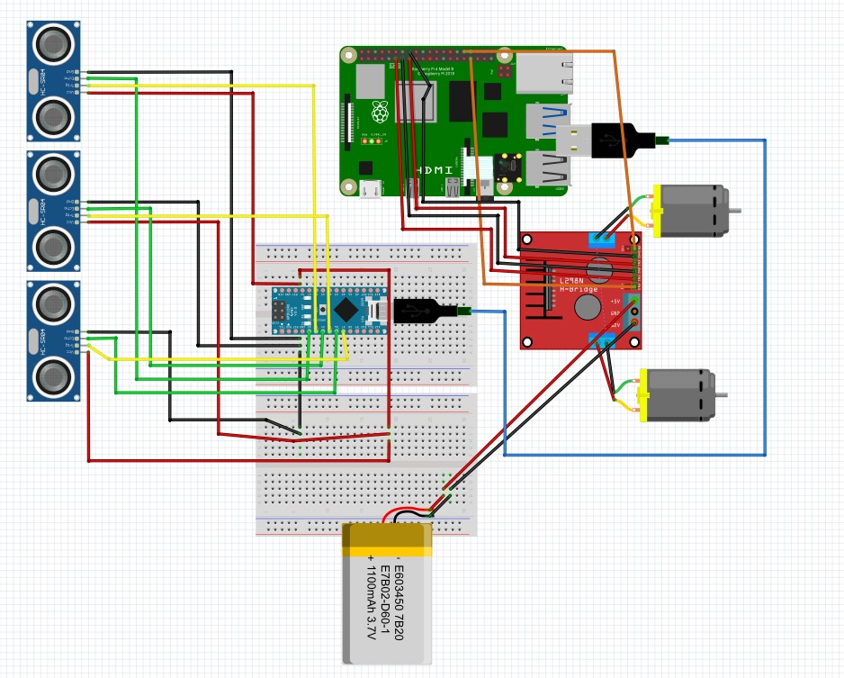
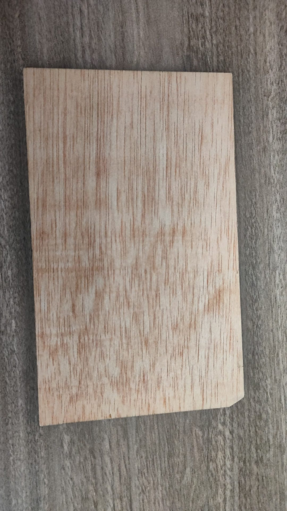
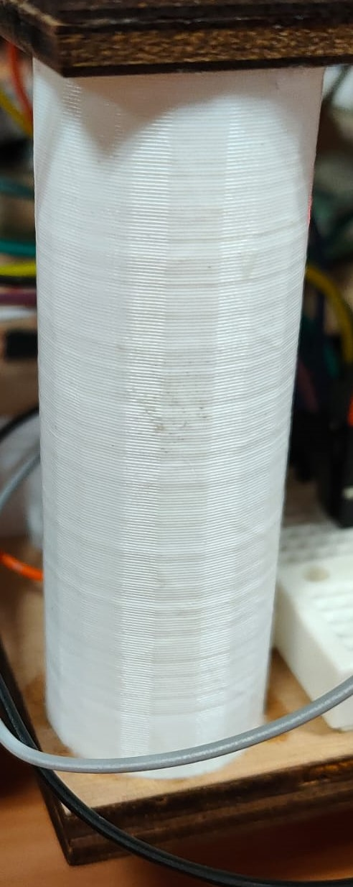
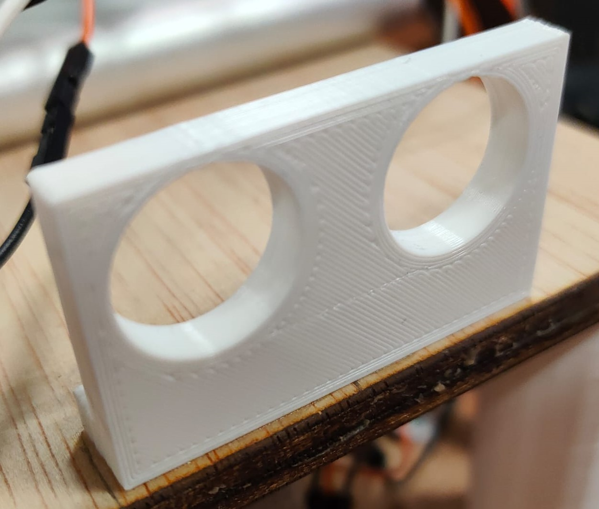

# ClassFinder
## INDEX
- Introducció
- Components
  - Components Elèctrics
  - Peces 3D
- Sistema Elèctric
- Algorisme Utilitzat
- Resultat Final
- Agraïments
- Autors

# Introducció
Classfinder és un projecte de l'assignatura de Robòtica del Grau enginyeria informàtica de la UAB.
El robot és un vehicle que utilitzant un sistema d'escàners i una càmera es guiarà al voltant de la facultat d'enginyeria. Se li demanarà per veu on es troba una aula concreta, q2 1005 per exemple, i el robot guiarà a la persona cap a aquella classe anant pel camí òptim.

# Components
### Components Elèctrics

- Motor Micro Metal LP con reductora 10:1

  

- Pareja de ruedas 80x10mm - Blanco

  
  
- Controlador de Motors L298
  
  
  
- Sensor de distancia por ultrasonidos HC-SR04

  

- Raspberry Pi 4 B+

  

- Cables dupond macho-macho

  

- Cables tipo DuPont Hembra - Hembra

  

- Altavoz 40mm / 3W

  

- Micrófono digital MEMS I2S SPH0645

  

- Cámara Raspberry Pi v2 - 8 Megapixels

  

- Arduino Nano Every

  

### Peces 3D
  
- Base i tapa del robot, peça sense forats. Fetes amb talladora laser

  
- Columna utilitzada per juntar la base i la tapa del robot. Fetes amb impresora 3D.

  
- Peça feta per donar suport als sensors i que puguin estar ben orientats. Fetes amb impresora 3D.

# Sistema Elèctric

## Descripción del esquema

La imagen muestra un circuito que incluye una Raspberry Pi, un Arduino Nano, un módulo controlador de motor L298N, dos motores DC, tres sensores ultrasónicos HC-SR04, y una batería. En el modelo físico, también se incluye una powerbank para alimentar a la Raspberry Pi.

## Enumeración de las conexiones

### Raspberry Pi

- **Conexión USB**: Alimentación de la Raspberry Pi.
- **Conexión USB**: Puerto micro USB del Arduino Nano.
- **GPIO**:
  - Pines 11, 13, 15, 16 conectados a IN1, IN2, IN3, IN4 del controlador L298N.
  - Pines GPIO 32 y 33 conectados a ENA y ENB del controlador L298N, ya que son PWM. Esto permite modificar el estado entre ON y OFF rápidamente, simulando una señal analógica para regular la potencia entregada a los motores. El pin 32 controla la potencia del motor A y el pin 33 la del motor B.

### Arduino Nano

- **Alimentación**: Conectado a la Raspberry Pi. También sirve de puerto serial para mandar la información de los sensores.
- **Pines de entrada/salida**:
  - Varios pines conectados a los sensores HC-SR04: pines del D2 al D7, pin de 5V y GND.

### Módulo L298N

- **Alimentación**: Conectado a la breadboard.
- **Motores DC**: Conectados a los terminales de salida del módulo.
- **Conexiones de control**: Conectados a los pines de la Raspberry Pi mencionados anteriormente.

### Sensores HC-SR04

- **Alimentación**: Conectados al Arduino Nano.
- **Pines de trigger y echo**: Conectados a los pines del Arduino Nano del D2 al D7 para los pines ECHO y TRIGGER. Conectados al pin de 5V y al GND del Arduino.

### Motores DC

- **Conexión**: Conectados a los terminales de salida del módulo L298N.

### Batería

- **Conexión**: Conectada a la breadboard para proporcionar alimentación.

## Enumeración de las conexiones detallada

### Raspberry Pi

- **GPIO**:
  - GPIO a la breadboard (puede estar proporcionando señales de control y datos al Arduino Nano y al módulo L298N).

### Arduino Nano

- **Vin**: A la fila de alimentación positiva de la breadboard.
- **GND**: A la fila de tierra de la breadboard.
- **D2**: A Trigger del sensor HC-SR04.
- **D3**: A Echo del sensor HC-SR04.
- **D4**: A Trigger del sensor HC-SR04.
- **D5**: A Echo del sensor HC-SR04.
- **D6**: A Trigger del sensor HC-SR04.
- **D7**: A Echo del sensor HC-SR04.

### Módulo L298N

- **IN1**: A Pin GPIO 11 de la Raspberry Pi.
- **IN2**: A Pin GPIO 13 de la Raspberry Pi.
- **IN3**: A Pin GPIO 15 de la Raspberry Pi.
- **IN4**: A Pin GPIO 16 de la Raspberry Pi.
- **ENA**: A Pin GPIO 32.
- **ENB**: A Pin GPIO 33.
- **OUT1**: A Motor DC (izquierdo).
- **OUT2**: A Motor DC (izquierdo).
- **OUT3**: A Motor DC (derecho).
- **OUT4**: A Motor DC (derecho).
- **GND**: A la fila de tierra de la breadboard.
- **+12V**: A la fila de alimentación positiva de la breadboard.

### Sensores HC-SR04

- **VCC**: De cada sensor a la fila de alimentación positiva del Arduino Nano.
- **GND**: De cada sensor a la fila de tierra del Arduino Nano.
- **Trigger y Echo**: Conectados a los pines correspondientes del Arduino Nano (ver arriba).

### Motores DC

- **Conexión**: Conectados a los terminales de salida del módulo L298N (ver arriba).

### Batería

- **+**: A la fila de alimentación positiva de la breadboard.
- **-**: A la fila de tierra de la breadboard.

# Algorisme Utilitzat
 Hem desenvolupat un robot que utilitza sensors d'ultrasons connectats a un Arduino per mesurar la distància entre el robot i els objectes del seu entorn. Aquesta informació es transmet des de l'Arduino a una Raspberry Pi a través d'un port sèrie. Quan s'inicialitza el sistema, es rep la distància de cada sensor.

L'algoritme de navegació del robot funciona de la següent manera:

Entrada de dades:

distàncies_sensors: Les distàncies mesurades per cada sensor d'ultrasons.
Càlcul del temps de desplaçament:

S'han realitzat mesures prèvies per determinar el temps que tarda el robot a anar d'un punt A a un punt B dins de cada passadís.
Aquest temps predefinit (temps_predefinit) es basa en la velocitat constant del robot i les distàncies entre els punts de referència (classes).
Gestió d'obstacles:

Si el robot detecta un obstacle, el sistema calcula el temps perdut (temps_perdut) degut a l'aturada i la maniobra necessària per esquivar l'obstacle.
Aquest temps perdut es suma al temps predefinit per ajustar el temps total de desplaçament (temps_total).
Càlcul del temps total:

El temps total es calcula com:
\text{temps_total} = \text{temps_predefinit} + \text{temps_perdut}
Sortida de dades:

El robot ajusta la seva ruta i el seu temps de desplaçament segons els obstacles detectats i la distància que encara ha de recórrer per arribar a la seva destinació.
Descripció del Funcionament
Quan el robot es mou cap a una destinació específica (una de les tres classes en cada passadís), utilitza els sensors d'ultrasons per detectar obstacles al seu camí. Si es troba amb un obstacle, el robot realitza els següents passos:

Es mesura el temps perdut degut a la detecció i l'esquiva de l'obstacle.
Aquest temps perdut s'afegeix al temps predefinit de desplaçament.
El robot continua el seu camí, ajustant el temps total segons sigui necessari per arribar al punt de destinació.
Aquest algoritme permet que el robot navegui de manera eficient i segura dins de l'edifici d'enginyeria, ajustant el seu temps de desplaçament segons les condicions reals del seu entorn.
# Resultat Final
 insertar foto de nuestra aberración
# Agraïments
Volem agrair a la UAB per poder facilitar la obtenció dels elements necesàris com per deixarnos les eines per fabricar i treballar amb ells. 
# Autors
- Arnau Ruzo 1597124 
- Marc Morillo 1600363
- Pol Muñoz 1601912
- David Feliu 1598106

