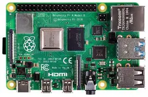
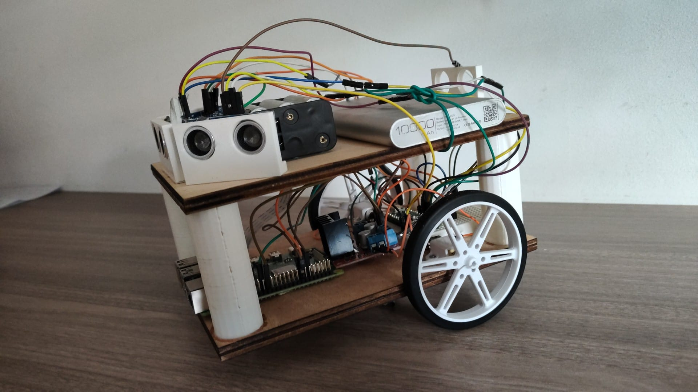

# ClassFinder
## INDEX
- Introducció
- Components
  - Components Elèctrics
  - Peces 3D
- Sistema Elèctric
- Algorisme Utilitzat
- Resultat Final
- Agraïments
- Autors

# Introducció
Classfinder és un projecte de l'assignatura de Robòtica del Grau enginyeria informàtica de la UAB.
El robot és un vehicle que utilitzant un sistema d'escàners i una càmera es guiarà al voltant de la facultat d'enginyeria. Se li demanarà per veu on es troba una aula concreta, q2 1005 per exemple, i el robot guiarà a la persona cap a aquella classe anant pel camí òptim.

# Components
### Components Elèctrics

- Motor Micro Metal LP con reductora 10:1

  

- Pareja de ruedas 80x10mm - Blanco

  
  
- Controlador de Motors L298
  
  
  
- Sensor de distancia por ultrasonidos HC-SR04

  

- Raspberry Pi 4 B+

  

- Cables dupond macho-macho

  

- Cables tipo DuPont Hembra - Hembra

  

- Altavoz 40mm / 3W

  

- Micrófono digital MEMS I2S SPH0645

  

- Cámara Raspberry Pi v2 - 8 Megapixels

  

- Arduino Nano Every

  

### Peces 3D
  
- Base i tapa del robot, peça sense forats. Fetes amb talladora laser

  
- Columna utilitzada per juntar la base i la tapa del robot. Fetes amb impresora 3D.

  
- Peça feta per donar suport als sensors i que puguin estar ben orientats. Fetes amb impresora 3D.

# Sistema Elèctric

## Descripció de l'esquema

La imatge mostra un circuit que inclou una Raspberry Pi, un Arduino Nano, un mòdul controlador de motor L298N, dos motors DC, tres sensors ultrasònics HC-SR04, i una bateria. En el model físic, també s'inclou una powerbank per alimentar la Raspberry Pi.

## Enumeració de les connexions

### Raspberry Pi

- **Connexió USB**: Alimentació de la Raspberry Pi.
- **Connexió USB**: Port micro USB de l'Arduino Nano.
- **GPIO**:
  - Pins 11, 13, 15, 16 connectats a IN1, IN2, IN3, IN4 del controlador L298N.
  - Pins GPIO 32 i 33 connectats a ENA i ENB del controlador L298N, ja que són PWM. Això permet modificar l'estat entre ON i OFF ràpidament, simulant un senyal analògic per regular la potència lliurada als motors. El pin 32 controla la potència del motor A i el pin 33 la del motor B.

### Arduino Nano

- **Alimentació**: Connectat a la Raspberry Pi. També serveix de port serial per enviar la informació dels sensors.
- **Pins d'entrada/sortida**:
  - Diversos pins connectats als sensors HC-SR04: pins del D2 al D7, pin de 5V i GND.

### Mòdul L298N

- **Alimentació**: Connectat a la breadboard.
- **Motors DC**: Connectats als terminals de sortida del mòdul.
- **Connexions de control**: Connectats als pins de la Raspberry Pi esmentats anteriorment.

### Sensors HC-SR04

- **Alimentació**: Connectats a l'Arduino Nano.
- **Pins de trigger i echo**: Connectats als pins de l'Arduino Nano del D2 al D7 per als pins ECHO i TRIGGER. Connectats al pin de 5V i al GND de l'Arduino.

### Motors DC

- **Connexió**: Connectats als terminals de sortida del mòdul L298N.

### Bateria

- **Connexió**: Connectada a la breadboard per proporcionar alimentació.

## Enumeració de les connexions detallada

### Raspberry Pi

- **GPIO**:
  - GPIO a la breadboard (pot estar proporcionant senyals de control i dades a l'Arduino Nano i al mòdul L298N).

### Arduino Nano

- **Vin**: A la fila d'alimentació positiva de la breadboard.
- **GND**: A la fila de terra de la breadboard.
- **D2**: A Trigger del sensor HC-SR04.
- **D3**: A Echo del sensor HC-SR04.
- **D4**: A Trigger del sensor HC-SR04.
- **D5**: A Echo del sensor HC-SR04.
- **D6**: A Trigger del sensor HC-SR04.
- **D7**: A Echo del sensor HC-SR04.

### Mòdul L298N

- **IN1**: Al Pin GPIO 11 de la Raspberry Pi.
- **IN2**: Al Pin GPIO 13 de la Raspberry Pi.
- **IN3**: Al Pin GPIO 15 de la Raspberry Pi.
- **IN4**: Al Pin GPIO 16 de la Raspberry Pi.
- **ENA**: Al Pin GPIO 32.
- **ENB**: Al Pin GPIO 33.
- **OUT1**: Al Motor DC (esquerre).
- **OUT2**: Al Motor DC (esquerre).
- **OUT3**: Al Motor DC (dret).
- **OUT4**: Al Motor DC (dret).
- **GND**: A la fila de terra de la breadboard.
- **+12V**: A la fila d'alimentació positiva de la breadboard.

### Sensors HC-SR04

- **VCC**: De cada sensor a la fila d'alimentació positiva de l'Arduino Nano.
- **GND**: De cada sensor a la fila de terra de l'Arduino Nano.
- **Trigger i Echo**: Connectats als pins corresponents de l'Arduino Nano (veure a dalt).

### Motors DC

- **Connexió**: Connectats als terminals de sortida del mòdul L298N (veure a dalt).

### Bateria

- **+**: A la fila d'alimentació positiva de la breadboard.
- **-**: A la fila de terra de la breadboard.

# Algorisme Utilitzat
 Hem desenvolupat un robot que utilitza sensors d'ultrasons connectats a un Arduino per mesurar la distància entre el robot i els objectes del seu entorn. Aquesta informació es transmet des de l'Arduino a una Raspberry Pi a través d'un port sèrie. Quan s'inicialitza el sistema, es rep la distància de cada sensor.

L'algoritme de navegació del robot funciona de la següent manera:

Entrada de dades:

distàncies_sensors: Les distàncies mesurades per cada sensor d'ultrasons.
Càlcul del temps de desplaçament:

S'han realitzat mesures prèvies per determinar el temps que tarda el robot a anar d'un punt A a un punt B dins de cada passadís.
Aquest temps predefinit (temps_predefinit) es basa en la velocitat constant del robot i les distàncies entre els punts de referència (classes).
Gestió d'obstacles:

Si el robot detecta un obstacle, el sistema calcula el temps perdut (temps_perdut) degut a l'aturada i la maniobra necessària per esquivar l'obstacle.
Aquest temps perdut es suma al temps predefinit per ajustar el temps total de desplaçament (temps_total).
Càlcul del temps total:

El temps total es calcula com:
\text{temps_total} = \text{temps_predefinit} + \text{temps_perdut}
Sortida de dades:

El robot ajusta la seva ruta i el seu temps de desplaçament segons els obstacles detectats i la distància que encara ha de recórrer per arribar a la seva destinació.
Descripció del Funcionament
Quan el robot es mou cap a una destinació específica (una de les tres classes en cada passadís), utilitza els sensors d'ultrasons per detectar obstacles al seu camí. Si es troba amb un obstacle, el robot realitza els següents passos:

Es mesura el temps perdut degut a la detecció i l'esquiva de l'obstacle.
Aquest temps perdut s'afegeix al temps predefinit de desplaçament.
El robot continua el seu camí, ajustant el temps total segons sigui necessari per arribar al punt de destinació.
Aquest algoritme permet que el robot navegui de manera eficient i segura dins de l'edifici d'enginyeria, ajustant el seu temps de desplaçament segons les condicions reals del seu entorn.

Per a que pugui avançar segons aquest algorisme, el robot utilitza una llibreria creada per nosaltres que conté totes les funcións necesaries per a la mobilitat basica del robot, aquesta llibreria utilitza els pins GPIO 
de la Raspberry pi per a controlar la velocitat i per lo tant tambe els girs del robot.

# Resultat Final

  
  
## Com Utilitzar-lo

### Pas 1: Connectar un Dispositiu Mòbil

Per utilitzar el robot, el primer pas és connectar un dispositiu mòbil amb la seva adreça MAC a un port sèrie de Bluetooth de la Raspberry Pi. 
Aquest pas només cal fer-lo un cop. Cada vegada que s'encengui el robot, la connexió s'establirà automàticament.

### Pas 2: Introduir la Classe

Després de connectar el dispositiu mòbil, utilitza l'aplicació per introduir la classe a la que vols anar (per exemple, Q21005) perquè el robot et guiï fins a l'aula.

### Exemple d'Ús

1. Connecta el teu dispositiu mòbil:
    ```sh
    # sudo rfcomm bind 0 XX:XX:XX:XX:XX:XX
    bluetoothctl
    ```
    - Activa el Bluetooth al teu dispositiu mòbil.
    - Assegura't que el Bluetooth de la Raspberry Pi és detectable.
    - Aparella el dispositiu usant la seva adreça MAC. (Comanda d'adalt).
    - Confirma l'aparellament en ambdós dispositius.

2. Utilitza l'aplicació per enviar el missatge:
    - Obre l'aplicació i selecciona la opció de connexió amb el robot.
    - Introdueix el codi de la classe a la que vols anar (per exemple, Q21005).
    - Envia el missatge a través del port sèrie del Bluetooth.

### Resolució de Problemes

- **Problemes de Connexió**: Si el dispositiu mòbil no es connecta automàticament, repeteix el procés d'aparellament.
- **Problemes de Guia**: Assegura't que el nom de la classe està introduït correctament i que el robot té un camí clar.


# Agraïments
Volem agrair a la UAB per poder facilitar la obtenció dels elements necesàris com per deixarnos les eines per fabricar i treballar amb ells. 
# Autors
- Arnau Ruzo 1597124 
- Marc Morillo 1600363
- Pol Muñoz 1601912
- David Feliu 1598106


